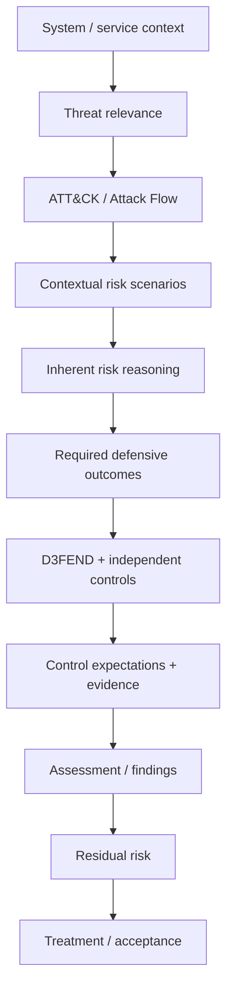

# ToBeDecidedLater

Working title. Serious problem. Unsettled name.

This is an early-stage research and engineering workspace exploring a machine-assisted, threat-informed cyber risk assessment methodology and executable reasoning engine.

The project investigates whether repeatable parts of cyber risk assessment can be represented as structured data, explicit rules, deterministic code, versioned authoritative inputs, and review decisions in order to improve consistency, reproducibility, traceability, and explainability without automating away necessary human judgment.

## Personal disclaimer

This repository and its contents reflect my personal research, ideas, experiments, and opinions.

They do not represent, imply, or communicate the views, positions, methodologies, policies, control libraries, tools, data, decisions, or official statements of any current or former employer, client, customer, vendor, institution, or affiliated organization.

This project is independent and published in a personal capacity.

## Vision

Develop an independent, open-standard-native cyber risk assessment methodology and executable reasoning engine that connects:

- system and service context;
- threat relevance and threat-informed risk scenarios;
- MITRE ATT&CK / Attack Flow adversary behaviour;
- explicit inherent-risk reasoning;
- MITRE D3FEND defensive knowledge;
- independently authored controls and evidence expectations;
- regulatory requirements such as DORA, NIS2 and Greek ADAE requirements;
- OSCAL catalogs, profiles, mappings and assessment artefacts;
- findings, residual risk and treatment.

The target philosophy is:

> **Rules calculate. Authoritative data supports. AI assists. Human reviewers certify.**

## AI-assisted, human-owned

This project uses AI as an assistant for drafting, coding, structuring ideas, and exploring implementation paths.

The project logic, risk model, methodology decisions, clean-room boundaries, validation, and final judgment remain human-owned.

AI output is treated as a draft, not as an authority.

## Core Concept

Conceptual high-level flow, not a final implementation architecture:

**Role boundaries:**

- **OSCAL** = downstream interoperability and representation.
- **Code** = deterministic execution of explicit methodology rules.
- **AI** = assistance, challenge, and drafting.
- **Human** = review, judgment, approval, and risk acceptance.

## What exists today

- One approved example risk scenario.
- Project-native scenario schema.
- Integrity manifests.
- Initial documentation and architecture notes.
- Early source code and tests.

## What does not exist yet

- No validated end-to-end methodology implementation.
- No production-grade reasoning engine or product.
- No complete control library.
- No regulatory mapping engine.
- No UI.
- No AI automation in the approval path.

## Private-to-public release model

Development happens privately first. Public releases contain only reviewed, cleaned, and approved artifacts.

See [`docs/release-model.md`](docs/release-model.md) for the public release model.

## External frameworks, tools, and authoritative sources

This project is designed to work with public/open cybersecurity, assurance, and regulatory sources. References to these sources do not imply endorsement, sponsorship, certification, or affiliation.

| Source / tool | Intended project role | Official reference |
| --- | --- | --- |
| MITRE ATT&CK | Public adversary-behaviour knowledge used as an input for threat-informed risk scenario generation. | https://attack.mitre.org/ |
| MITRE ATT&CK STIX data | Versioned structured ATT&CK source data for controlled local snapshots and provenance. | https://github.com/mitre-attack/attack-stix-data |
| MITRE Attack Flow | Candidate representation for adversary behaviour sequences where attack ordering matters. | https://github.com/center-for-threat-informed-defense/attack-flow |
| MITRE D3FEND | Public defensive-knowledge input for candidate defensive outcomes and control objectives. | https://d3fend.mitre.org/ |
| NIST OSCAL | Machine-readable interoperability layer for catalogs, profiles, mappings, assessment artifacts, and POA&M/remediation outputs. | https://pages.nist.gov/OSCAL/ |
| NIST OSCAL GitHub | OSCAL schemas, models, content, and tooling references. | https://github.com/usnistgov/OSCAL |
| DORA | Public EU regulatory source for future structured requirement and mapping experiments. | https://eur-lex.europa.eu/eli/reg/2022/2554/oj |
| NIS2 | Public EU regulatory source for future structured requirement and mapping experiments. | https://eur-lex.europa.eu/eli/dir/2022/2555/oj |
| Greek ADAE requirements | Public Greek electronic-communications security/privacy regulatory source for future structured requirement and mapping experiments. | https://adae.gov.gr/ |

See [`THIRD_PARTY_NOTICES.md`](THIRD_PARTY_NOTICES.md) for third-party notices, terms, trademarks, and non-endorsement statements.

## Initial Documentation

- [`docs/00-clean-room-ip-boundary.md`](docs/00-clean-room-ip-boundary.md)
- [`docs/01-project-vision.md`](docs/01-project-vision.md)
- [`docs/02-target-architecture.md`](docs/02-target-architecture.md)
- [`docs/03-risk-scenario-compiler.md`](docs/03-risk-scenario-compiler.md)
- [`docs/04-oscal-and-regulatory-model.md`](docs/04-oscal-and-regulatory-model.md)
- [`docs/05-research-landscape.md`](docs/05-research-landscape.md)
- [`docs/06-technical-environment.md`](docs/06-technical-environment.md)
- [`docs/07-roadmap.md`](docs/07-roadmap.md)
- [`docs/08-design-decisions.md`](docs/08-design-decisions.md)
- [`docs/decision-log.md`](docs/decision-log.md)
- [`docs/release-model.md`](docs/release-model.md)

## License

This repository uses a mixed-license model:

- Code, scripts, schemas, machine-readable artifacts, validation logic, and tooling are licensed under the [Apache License 2.0](LICENSE), unless otherwise stated.
- Documentation, diagrams, methodology notes, research notes, explanatory text, and narrative framework content are licensed under [Creative Commons Attribution 4.0 International](LICENSE-docs.md), unless otherwise stated.

Third-party materials, standards, frameworks, regulatory texts, MITRE content, OSCAL references, and other external sources remain subject to their own licenses, terms, and attribution requirements.

## Status

**Phase:** research / architecture definition.

No validated end-to-end methodology implementation, production-grade reasoning engine, deployed product, or authoritative control/risk catalog exists yet.
