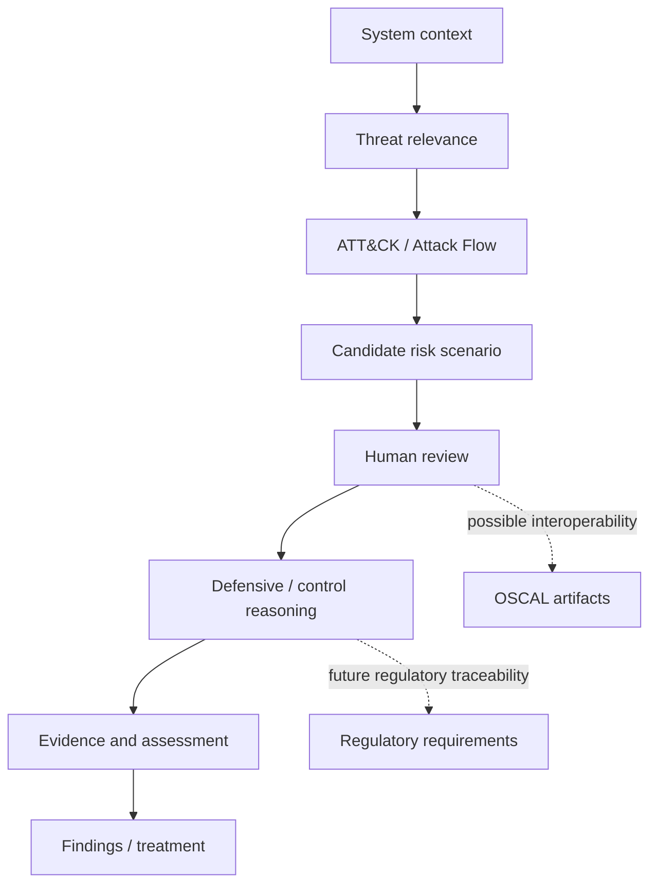

# ToBeDecidedLater

Working title. Serious problem. Unsettled name.

This repository documents a personal, early-stage research and engineering exploration into threat-informed cyber risk assessment.

I am using it to investigate whether parts of cyber risk reasoning can be represented more explicitly through structured data, traceable source provenance, deterministic code, and human review. The work is exploratory: it may narrow, change direction, or remain a research prototype as the ideas are tested.

There is no predetermined product, framework, or commercial endpoint. The purpose of the project is to investigate the idea, preserve useful results, and revise or discard assumptions when the evidence does not support them.

## Personal disclaimer

This repository and its contents reflect my personal research, ideas, experiments, and opinions.

They do not represent, imply, or communicate the views, positions, methodologies, policies, control libraries, tools, data, decisions, or official statements of any current or former employer, client, customer, vendor, institution, or affiliated organization.

This project is independent and published in a personal capacity.

## What exists today

The current public repository contains a small research prototype rather than an end-to-end assessment system:

- one project-owner-approved experimental scenario; see the [scenario index and limitations](scenarios/README.md);
- a project-native risk-scenario model and schema;
- a versioned compact ATT&CK source snapshot with provenance metadata;
- rendering and integrity tooling for the published example;
- initial documentation, architecture notes, source code, and tests.

These artifacts show that some parts of the proposed workflow can be represented and checked programmatically. They do not establish that the underlying risk judgments are correct or that the approach improves real-world assessments.

## What does not exist today

The public repository does **not** currently provide:

- a validated end-to-end cyber risk assessment methodology;
- a production-grade product or reasoning engine;
- a complete or authoritative control library;
- a general-purpose scenario-generation engine;
- an implemented regulatory mapping or compliance-assurance engine;
- an implemented residual-risk model;
- OSCAL assessment outputs for a complete workflow;
- a user interface;
- autonomous AI approval or risk-acceptance decisions.

Future exploration of any of these areas is conditional on the smaller research questions proving useful first.

## Current validation status

This repository contains an early research prototype and one scenario approved by the project owner for inclusion in the experimental library. Project approval does not constitute independent validation or certification.

The published CIA ratings and aggregate score do not yet have a documented, validated calibration basis. They should not be used to score or compare systems or to support operational risk decisions. Read the [dated scoring limitation notice](docs/validation-status.md) before using the example.

Source provenance, integrity checks, and schema validation support traceability and structural consistency; they do not establish the correctness of risk judgments. Practical usefulness and assessment consistency remain to be evaluated.

## Research direction

The project is exploring whether a useful and reviewable chain can be built between:

- system and service context;
- threat-informed risk scenarios;
- MITRE ATT&CK / Attack Flow adversary behaviour;
- defensive knowledge and independently authored controls;
- evidence expectations and assessment observations;
- regulatory requirements as separately sourced obligations;
- OSCAL as a downstream interoperability format;
- findings, treatment, and eventually residual-risk reasoning.

This list describes a research direction, not a committed implementation roadmap. Some elements may prove unnecessary, unsuitable, or too costly to justify.

A guiding principle is:

> **Rules support consistent processing. Authoritative sources inform. AI assists. Human reviewers decide.**

## AI-assisted, human-owned

This project uses AI as an assistant for drafting, coding, structuring ideas, reviewing alternatives, and exploring implementation paths.

The project logic, risk model, methodology decisions, clean-room boundaries, validation, and final judgment remain human-owned.

AI output is treated as a draft or challenge input, not as an authority, approver, or risk owner.

## Concept under investigation

The following is a conceptual research flow, not a statement that every component is implemented:

The immediate research question is smaller than this diagram: can a structured approach make scenario applicability, control rationale, evidence expectations, and review decisions more explicit and reproducible without replacing necessary human judgment?

## Private-to-public release model

Development happens privately first. Public releases contain only reviewed, cleaned, and intentionally selected artifacts.

See [`docs/release-model.md`](docs/release-model.md) for the public release model.

## External frameworks, tools, and authoritative sources

This project is designed to work with public/open cybersecurity, assurance, and regulatory sources. References to these sources do not imply endorsement, sponsorship, certification, or affiliation.

| Source / tool | Intended research role | Official reference |
| --- | --- | --- |
| MITRE ATT&CK | Public adversary-behaviour knowledge used as an input for threat-informed scenario research. | https://attack.mitre.org/ |
| MITRE ATT&CK STIX data | Versioned structured ATT&CK source data for controlled local snapshots and provenance. | https://github.com/mitre-attack/attack-stix-data |
| MITRE Attack Flow | Candidate representation for adversary-behaviour sequences where ordering matters. | https://github.com/center-for-threat-informed-defense/attack-flow |
| MITRE D3FEND | Public defensive-knowledge source that may inform candidate defensive outcomes and controls. | https://d3fend.mitre.org/ |
| NIST OSCAL | Candidate downstream interoperability layer for catalogs, profiles, mappings, and assessment artifacts. | https://pages.nist.gov/OSCAL/ |
| NIST OSCAL GitHub | OSCAL schemas, models, content, and tooling references. | https://github.com/usnistgov/OSCAL |
| DORA | Public EU regulatory source for possible future structured requirement and mapping experiments. | https://eur-lex.europa.eu/eli/reg/2022/2554/oj |
| NIS2 | Public EU regulatory source for possible future structured requirement and mapping experiments. | https://eur-lex.europa.eu/eli/dir/2022/2555/oj |
| Greek ADAE requirements | Public Greek electronic-communications security/privacy source for possible future structured requirement and mapping experiments. | https://adae.gov.gr/ |

See [`THIRD_PARTY_NOTICES.md`](THIRD_PARTY_NOTICES.md) for third-party notices, terms, trademarks, and non-endorsement statements.

## Documentation

The documentation includes both implemented material and proposed research directions. Individual documents should be read with their status and limitations in mind.

- [`docs/00-clean-room-ip-boundary.md`](docs/00-clean-room-ip-boundary.md)
- [`docs/01-project-vision.md`](docs/01-project-vision.md)
- [`docs/02-target-architecture.md`](docs/02-target-architecture.md)
- [`docs/03-risk-scenario-compiler.md`](docs/03-risk-scenario-compiler.md)
- [`docs/04-oscal-and-regulatory-model.md`](docs/04-oscal-and-regulatory-model.md)
- [`docs/05-research-landscape.md`](docs/05-research-landscape.md)
- [`docs/06-technical-environment.md`](docs/06-technical-environment.md)
- [`docs/07-roadmap.md`](docs/07-roadmap.md)
- [`docs/08-design-decisions.md`](docs/08-design-decisions.md)
- [`docs/decision-log.md`](docs/decision-log.md)
- [`docs/release-model.md`](docs/release-model.md)
- [`docs/validation-status.md`](docs/validation-status.md)

## License

This repository uses a mixed-license model:

- Code, scripts, schemas, machine-readable artifacts, validation logic, and tooling are licensed under the [Apache License 2.0](LICENSE), unless otherwise stated.
- Documentation, diagrams, methodology notes, research notes, explanatory text, and narrative content are licensed under [Creative Commons Attribution 4.0 International](LICENSE-docs.md), unless otherwise stated.

Third-party materials, standards, frameworks, regulatory texts, MITRE content, OSCAL references, and other external sources remain subject to their own licenses, terms, and attribution requirements.

## Status

**Phase:** early research / prototype exploration.

The project has no predetermined endpoint. Its current value is as a structured experiment into traceable cyber risk reasoning; whether it should evolve into a broader methodology, reusable tooling, or something narrower remains an open research question.
